# NeoScreem ERD - Diagram Trực Quan

```mermaid
erDiagram
    %% Core Authentication Tables
    users {
        bigint id PK
        varchar name
        varchar email UK
        timestamp email_verified_at
        varchar password
        varchar remember_token
        timestamp created_at
        timestamp updated_at
    }
    
    password_reset_tokens {
        varchar email PK
        varchar token
        timestamp created_at
    }
    
    sessions {
        varchar id PK
        bigint user_id FK
        varchar ip_address
        text user_agent
        longtext payload
        integer last_activity
    }
    
    %% Movie Management Tables
    phim {
        bigint id PK
        varchar ten_phim
        varchar dao_dien
        varchar dien_vien
        varchar the_loai
        integer thoi_luong
        text mo_ta
        varchar anh_poster
        varchar trailer_url
        timestamp created_at
        timestamp updated_at
    }
    
    khuyen_mai {
        bigint id PK
        varchar ten_khuyen_mai
        text mo_ta
        decimal phan_tram_giam_gia
        decimal so_tien_giam_gia
        date ngay_bat_dau
        date ngay_ket_thuc
        varchar anh_banner
        timestamp created_at
        timestamp updated_at
    }
    
    phim_khuyen_mai {
        bigint phim_id PK,FK
        bigint khuyen_mai_id PK,FK
    }
    
    %% Theater & Showtime Tables
    theaters {
        bigint id PK
        varchar name
        varchar location
        timestamp created_at
        timestamp updated_at
    }
    
    showtimes {
        bigint id PK
        bigint phim_id FK
        bigint theater_id FK
        date ngay_chieu
        time gio_chieu
        decimal gia_ve
        timestamp created_at
        timestamp updated_at
    }
    
    bookings {
        bigint id PK
        bigint user_id FK
        bigint showtime_id FK
        varchar seats
        decimal total_price
        varchar booking_status
        timestamp created_at
        timestamp updated_at
    }
    
    %% Admin Management Tables
    statistics {
        bigint id PK
        integer tickets_sold_today
        decimal revenue_today
        decimal avg_customers_per_store
        decimal campaign_roi
        timestamp created_at
        timestamp updated_at
    }
    
    employees {
        bigint id PK
        varchar code UK
        varchar name
        varchar department
        varchar position
        varchar email
        varchar phone
        date hire_date
        decimal salary
        varchar status
        timestamp created_at
        timestamp updated_at
    }
    
    schedules {
        bigint id PK
        bigint employee_id FK
        varchar department
        date date
        time start_time
        time end_time
        integer break_duration
        varchar status
        text notes
        timestamp created_at
        timestamp updated_at
    }
    
    report_schedules {
        bigint id PK
        varchar email
        varchar cadence
        json filters
        timestamp next_run_at
        boolean is_active
        timestamp created_at
        timestamp updated_at
    }
    
    report_templates {
        bigint id PK
        varchar name UK
        text description
        json config
        timestamp created_at
        timestamp updated_at
    }
    
    segments {
        bigint id PK
        varchar name UK
        json filters
        integer size
        bigint created_by FK
        timestamp created_at
        timestamp updated_at
    }
    
    %% System Tables
    cache {
        varchar key PK
        mediumtext value
        integer expiration
    }
    
    cache_locks {
        varchar key PK
        varchar owner
        integer expiration
    }
    
    jobs {
        bigint id PK
        varchar queue
        longtext payload
        tinyint attempts
        integer reserved_at
        integer available_at
        integer created_at
    }
    
    job_batches {
        varchar id PK
        varchar name
        integer total_jobs
        integer pending_jobs
        integer failed_jobs
        longtext failed_job_ids
        text options
        integer cancelled_at
        integer created_at
        integer finished_at
    }
    
    failed_jobs {
        bigint id PK
        varchar uuid UK
        text connection
        text queue
        longtext payload
        longtext exception
        timestamp failed_at
    }
    
    %% Relationships
    users ||--o{ bookings : "đặt vé"
    users ||--o{ sessions : "có session"
    users ||--o{ segments : "tạo phân khúc"
    users ||--o{ password_reset_tokens : "reset password"
    
    phim ||--o{ showtimes : "có suất chiếu"
    phim ||--o{ phim_khuyen_mai : "áp dụng KM"
    
    khuyen_mai ||--o{ phim_khuyen_mai : "cho phim"
    
    theaters ||--o{ showtimes : "chiếu phim"
    
    showtimes ||--o{ bookings : "được đặt"
    
    employees ||--o{ schedules : "có lịch làm"
    
    %% Relationships with cascade delete
    users ||--o{ bookings : "cascade delete"
    showtimes ||--o{ bookings : "cascade delete"
    phim ||--o{ phim_khuyen_mai : "cascade delete"
    khuyen_mai ||--o{ phim_khuyen_mai : "cascade delete"
    employees ||--o{ schedules : "cascade delete"
    
    %% Nullable relationships
    users ||--o{ sessions : "nullable"
    users ||--o{ segments : "nullable on delete"
    theaters ||--o{ showtimes : "nullable"
```

## Chú thích Diagram

### Ký hiệu
- **PK**: Primary Key (Khóa chính)
- **FK**: Foreign Key (Khóa ngoại)
- **UK**: Unique Key (Khóa duy nhất)
- **||--o{**: One-to-Many relationship (Một-Nhiều)
- **||--|{**: One-to-Many (Required)
- **}o--||**: Many-to-One (Optional)

### Flow chính của hệ thống
1. **User Flow**: users → bookings → showtimes → phim
2. **Admin Flow**: employees → schedules → statistics/reports
3. **Promotion Flow**: khuyen_mai → phim_khuyen_mai → phim
4. **Theater Flow**: theaters → showtimes → bookings

### Mối quan hệ quan trọng
- **User - Bookings**: Một user có thể đặt nhiều vé
- **Phim - Showtimes**: Một phim có nhiều suất chiếu
- **Showtimes - Bookings**: Một suất chiếu có nhiều đặt vé
- **Employees - Schedules**: Một nhân viên có nhiều lịch làm việc
- **Phim - Khuyến mãi**: Nhiều-nhiều qua bảng junction `phim_khuyen_mai`
