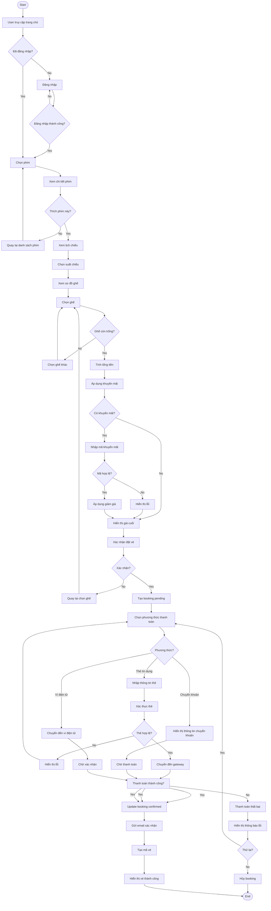

# NeoScreem UML - Activity Diagram

## Activity Diagram: Flow Đặt Vé Phim



## Activity Diagram: Flow Đăng Nhập

```mermaid
graph TD
    Start([Start]) --> B1[User mở trang đăng nhập]
    B1 --> B2[Nhập email và password]
    B2 --> B3[Click Đăng nhập]
    B3 --> B4[Validate input]
    B4 --> B5{Input hợp lệ?}
    
    B5 -->|No| B6[Hiển thị lỗi validation]
    B6 --> B2
    
    B5 -->|Yes| B7[Kiểm tra email tồn tại]
    B7 --> B8{Email tồn tại?}
    
    B8 -->|No| B9[Hiển thị "Email không tồn tại"]
    B9 --> B2
    
    B8 -->|Yes| B10[Kiểm tra password]
    B10 --> B11{Password đúng?}
    
    B11 -->|No| B12[Hiển thị "Sai mật khẩu"]
    B12 --> B2
    
    B11 -->|Yes| B13[Kiểm tra tài khoản verified?]
    B13 --> B14{Đã verified?}
    
    B14 -->|No| B15[Hiển thị "Tài khoản chưa xác thực"]
    B15 --> B16[Gửi lại email xác nhận]
    B16 --> B17[Yêu cầu user xác thực email]
    B17 --> End([End])
    
    B14 -->|Yes| B18[Tạo session]
    B18 --> B19[Lưu thông tin user vào session]
    B19 --> B20[Redirect đến dashboard]
    B20 --> B21{User type?}
    
    B21 -->|User| B22[Redirect đến trang user]
    B21 -->|Staff| B23[Redirect đến trang staff]
    B21 -->|Admin| B24[Redirect đến trang admin]
    
    B22 --> End
    B23 --> End
    B24 --> End
```

## Activity Diagram: Flow Quản Lý Phim (Admin)

```mermaid
graph TD
    Start([Start]) --> C1[Admin đăng nhập]
    C1 --> C2[Navigate đến Quản lý phim]
    C2 --> C3{Action?}
    
    C3 -->|Thêm phim| C4[Nhập thông tin phim]
    C4 --> C5[Upload poster]
    C5 --> C6[Upload trailer]
    C6 --> C7[Nhập diễn viên/đạo diễn]
    C7 --> C8[Chọn thể loại]
    C8 --> C9[Nhập thời lượng]
    C9 --> C10[Nhập mô tả]
    C10 --> C11[Validate thông tin]
    C11 --> C12{Thông tin hợp lệ?}
    
    C12 -->|No| C13[Hiển thị lỗi]
    C13 --> C4
    
    C12 -->|Yes| C14[Lưu phim vào database]
    C14 --> C15[Update search index]
    C15 --> C16[Hiển thị "Thêm thành công"]
    C16 --> C17[Quay lại danh sách]
    C17 --> End([End])
    
    C3 -->|Sửa phim| C18[Chọn phim cần sửa]
    C18 --> C19[Hiển thị form edit]
    C19 --> C20[Chỉnh sửa thông tin]
    C20 --> C21[Validate changes]
    C21 --> C22{Changes hợp lệ?}
    
    C22 -->|No| C23[Hiển thị lỗi]
    C23 --> C20
    
    C22 -->|Yes| C24[Update phim]
    C24 --> C25[Update search index]
    C25 --> C26[Hiển thị "Cập nhật thành công"]
    C26 --> C17
    
    C3 -->|Xóa phim| C27[Chọn phim cần xóa]
    C27 --> C28[Kiểm tra booking tồn tại]
    C28 --> C29{Có booking?}
    
    C29 -->|Yes| C30[Hiển thị cảnh báo]
    C30 --> C31{Vẫn xóa?}
    C31 -->|No| C17
    C31 -->|Yes| C32[Cancel tất cả booking]
    C32 --> C33[Xóa phim]
    
    C29 -->|No| C33
    C33 --> C34[Xóa file media]
    C34 --> C35[Update search index]
    C35 --> C36[Hiển thị "Xóa thành công"]
    C36 --> C17
```

## Activity Diagram: Flow Thanh Toán Offline (Staff)

```mermaid
graph TD
    Start([Start]) --> D1[Khách hàng đến quầy]
    D1 --> D2[Staff đăng nhập]
    D2 --> D3[Nhập thông tin khách hàng]
    D3 --> D4{Khách hàng có tài khoản?}
    
    D4 -->|No| D5[Tạo tài khoản nhanh]
    D5 --> D6[Nhập tên, SĐT]
    D6 --> D7[Tạo user mới]
    D7 --> D8
    
    D4 -->|Yes| D8[Tìm kiếm user]
    D8 --> D9[Kiểm tra user tồn tại]
    D9 --> D10{User tồn tại?}
    
    D10 -->|No| D11[Hiển thị "Không tìm thấy"]
    D11 --> D3
    
    D10 -->|Yes| D12[Chọn phim]
    D12 --> D13[Xem lịch chiếu hôm nay]
    D13 --> D14[Chọn suất chiếu]
    D14 --> D15[Xem sơ đồ ghế]
    D15 --> D16[Khách hàng chọn ghế]
    D16 --> D17{Ghế còn trống?}
    
    D17 -->|No| D18[Thông báo ghế đã đặt]
    D18 --> D16
    
    D17 -->|Yes| D19[Tính tổng tiền]
    D19 --> D20{Áp dụng khuyến mãi?}
    
    D20 -->|Yes| D21[Nhập mã khuyến mãi]
    D21 --> D22[Kiểm tra mã]
    D22 --> D23{Mã hợp lệ?}
    D23 -->|No| D24[Thông báo mã không hợp lệ]
    D24 --> D20
    D23 -->|Yes| D25[Áp dụng giảm giá]
    D25 --> D26[Hiển thị giá cuối]
    
    D20 -->|No| D26
    
    D26 --> D27[Khách hàng thanh toán]
    D27 --> D28[Nhận tiền]
    D28 --> D29[Kiểm tra số tiền]
    D29 --> D30{Tiền đủ?}
    
    D30 -->|No| D31[Yêu cầu bổ sung]
    D31 --> D27
    
    D30 -->|Yes| D32[Tính tiền thối]
    D32 --> D33[Tạo booking confirmed]
    D33 --> D34[Xuất vé giấy]
    D34 --> D35[In vé]
    D35 --> D36[Giao vé cho khách]
    D36 --> End([End])
```

## Giải Thích Activity Diagrams

### 1. **Flow Đặt Vé Online**
- **Decision Points**: Login check, seat availability, payment method, payment success
- **Parallel Processing**: Áp dụng khuyến mãi song song với tính giá
- **Error Handling**: Validation errors, payment failures, seat conflicts
- **Alternative Flows**: Chọn lại ghế, thay đổi phương thức thanh toán

### 2. **Flow Đăng Nhập**
- **Security Layers**: Input validation, email existence, password verification
- **Account States**: Verified vs Unverified accounts
- **Role-based Routing**: User/Staff/Admin dashboard
- **Recovery Options**: Resend verification email

### 3. **Flow Quản Lý Phim**
- **CRUD Operations**: Create, Read, Update, Delete phim
- **Data Integrity**: Validation trước khi lưu
- **Media Management**: Upload/delete poster và trailer
- **Search Integration**: Update search index sau khi thay đổi
- **Safety Checks**: Kiểm tra booking trước khi xóa

### 4. **Flow Thanh Toán Offline**
- **Customer Management**: Tạo tài khoản nhanh cho khách vãng lai
- **Real-time Operations**: Kiểm tra ghế trống real-time
- **Payment Processing**: Xử lý tiền mặt và tính tiền thối
- **Physical Output**: In vé giấy cho khách hàng

### **Các Ký Hiệu Activity Diagram**
- **Oval**: Start/End points
- **Rectangle**: Activities/Actions
- **Diamond**: Decision points
- **Parallelogram**: Input/Output
- **Swimlanes**: Phân chia trách nhiệm (User, System, Staff)
- **Arrows**: Flow direction

### **Best Practices Applied**
1. **Clear Start/End points**
2. **Decision logic rõ ràng**
3. **Error handling paths**
4. **Alternative flows**
5. **Parallel activities khi có thể**
6. **Consistent naming conventions**
