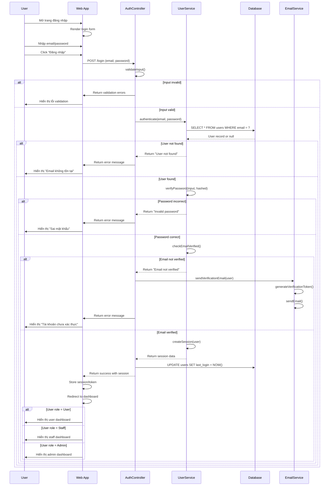
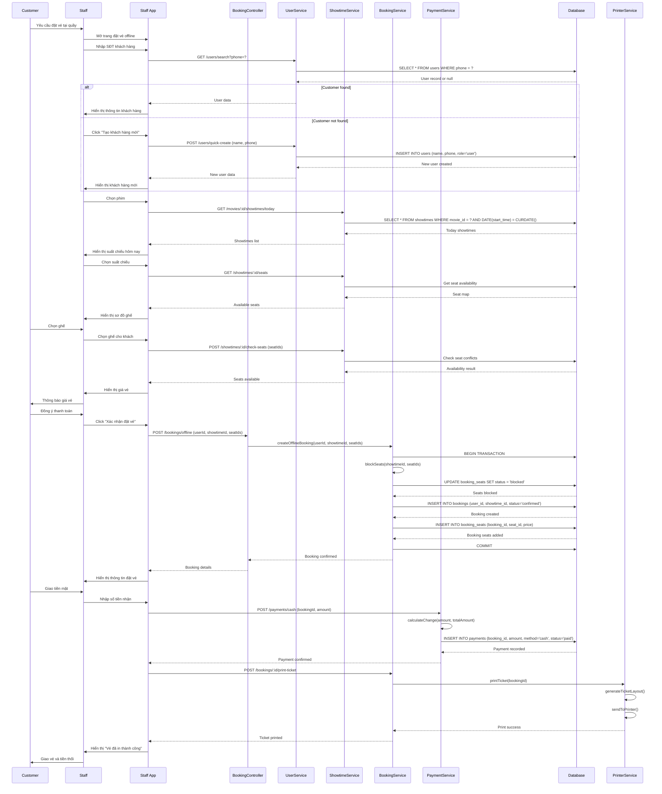

# NeoScreem UML - Sequence Diagram

## Sequence Diagram: Đăng Nhập Hệ Thống

## Sequence Diagram: Đặt Vé Online

```mermaid
sequenceDiagram
    participant User
    participant Frontend as Web App
    participant BookingController
    participant MovieService
    participant ShowtimeService
    participant SeatService
    participant BookingService
    participant PaymentService
    participant Database
    participant NotificationService
    
    User->>Frontend: Chọn phim
    Frontend->>MovieService: GET /movies/:id
    MovieService->>Database: SELECT * FROM movies WHERE id = ?
    Database-->>MovieService: Movie details
    MovieService-->>Frontend: Movie data
    Frontend->>User: Hiển thị chi tiết phim
    
    User->>Frontend: Click "Xem lịch chiếu"
    Frontend->>ShowtimeService: GET /movies/:id/showtimes
    ShowtimeService->>Database: SELECT * FROM showtimes WHERE movie_id = ? AND start_time > NOW()
    Database-->>ShowtimeService: Showtimes list
    ShowtimeService-->>Frontend: Showtimes data
    Frontend->>User: Hiển thị lịch chiếu
    
    User->>Frontend: Chọn suất chiếu
    Frontend->>ShowtimeService: GET /showtimes/:id/seats
    ShowtimeService->>SeatService: getAvailableSeats(showtimeId)
    SeatService->>Database: SELECT seats.* FROM seats LEFT JOIN booking_seats ON seats.id = booking_seats.seat_id WHERE booking_seats.status != 'confirmed'
    Database-->>SeatService: Available seats
    SeatService-->>ShowtimeService: Seat availability
    ShowtimeService-->>Frontend: Seat map
    Frontend->>User: Hiển thị sơ đồ ghế
    
    User->>Frontend: Chọn ghế
    Frontend->>Frontend: Highlight selected seats
    Frontend->>ShowtimeService: POST /showtimes/:id/check-seats (seatIds)
    ShowtimeService->>SeatService: checkAvailability(showtimeId, seatIds)
    SeatService->>Database: Check seat conflicts
    Database-->>SeatService: Conflict status
    SeatService-->>ShowtimeService: Availability result
    
    alt Seats available
        ShowtimeService-->>Frontend: Seats available
        Frontend->>User: Hiển thị giá vé
        Frontend->>User: Hiển thị tổng tiền
        
        User->>Frontend: Nhập mã khuyến mãi (tùy chọn)
        Frontend->>BookingService: POST /promotions/validate (code, amount)
        BookingService->>Database: SELECT * FROM promotions WHERE code = ?
        Database-->>BookingService: Promotion details
        BookingService->>BookingService: validatePromotion()
        BookingService-->>Frontend: Discount amount
        Frontend->>User: Hiển thị giá sau giảm
        
        User->>Frontend: Click "Xác nhận đặt vé"
        Frontend->>BookingController: POST /bookings (showtimeId, seatIds, promotionCode)
        BookingController->>BookingService: createBooking(userId, showtimeId, seatIds, promotionCode)
        
        BookingService->>Database: BEGIN TRANSACTION
        BookingService->>SeatService: blockSeats(showtimeId, seatIds)
        SeatService->>Database: UPDATE booking_seats SET status = 'blocked'
        Database-->>SeatService: Seats blocked
        SeatService-->>BookingService: Block success
        
        BookingService->>BookingService: calculateTotalAmount(seatIds, promotionCode)
        BookingService->>Database: INSERT INTO bookings (user_id, showtime_id, total_amount, status)
        Database-->>BookingService: Booking created
        BookingService->>Database: INSERT INTO booking_seats (booking_id, seat_id, price)
        Database-->>BookingService: Booking seats added
        
        alt Promotion applied
            BookingService->>Database: UPDATE promotions SET used_count = used_count + 1
        end
        
        BookingService->>Database: COMMIT
        BookingService-->>BookingController: Booking created with booking code
        BookingController-->>Frontend: Booking details
        
        Frontend->>User: Hiển thị trang thanh toán
        User->>Frontend: Chọn phương thức thanh toán
        
        alt Credit Card
            Frontend->>PaymentService: POST /payments/credit-card (bookingId, cardInfo)
            PaymentService->>PaymentService: validateCardInfo()
            PaymentService->>PaymentService: processPayment()
            PaymentService->>PaymentService: chargeCard()
            PaymentService-->>Frontend: Payment result
        else Bank Transfer
            Frontend->>PaymentService: POST /payments/bank-transfer (bookingId)
            PaymentService->>PaymentService: generateTransferInfo()
            PaymentService-->>Frontend: Transfer instructions
            Frontend->>User: Hiển thị thông tin chuyển khoản
        else E-wallet
            Frontend->>PaymentService: POST /payments/ewallet (bookingId, provider)
            PaymentService->>PaymentService: redirectToEWallet()
            PaymentService-->>Frontend: Redirect URL
            Frontend->>User: Chuyển đến ví điện tử
        end
        
        PaymentService->>BookingService: updatePaymentStatus(bookingId, status)
        
        alt Payment successful
            BookingService->>BookingService: confirmBooking(bookingId)
            BookingService->>Database: UPDATE bookings SET status = 'confirmed', payment_status = 'paid'
            BookingService->>SeatService: confirmSeats(bookingId)
            SeatService->>Database: UPDATE booking_seats SET status = 'confirmed'
            
            BookingService->>NotificationService: sendBookingConfirmation(bookingId)
            NotificationService->>NotificationService: generateQRCode()
            NotificationService->>NotificationService: sendEmail()
            
            BookingService-->>PaymentService: Booking confirmed
            PaymentService-->>Frontend: Payment success
            Frontend->>User: Hiển thị vé thành công
        else Payment failed
            BookingService->>BookingService: cancelBooking(bookingId)
            BookingService->>SeatService: releaseSeats(bookingId)
            SeatService->>Database: UPDATE booking_seats SET status = 'available'
            BookingService->>Database: UPDATE bookings SET status = 'cancelled'
            
            BookingService-->>PaymentService: Booking cancelled
            PaymentService-->>Frontend: Payment failed
            Frontend->>User: Hiển thị lỗi thanh toán
        end
    else Seats not available
        ShowtimeService-->>Frontend: Seats unavailable
        Frontend->>User: Hiển thị "Ghế đã được đặt"
    end
```

## Sequence Diagram: Thanh Toán Offline (Staff)

## Sequence Diagram: Quản Lý Phim (Admin)

```mermaid
sequenceDiagram
    participant Admin
    participant Frontend as Admin Panel
    participant MovieController
    participant MovieService
    participant GenreService
    participant ActorService
    participant FileService
    participant Database
    participant SearchService
    
    Admin->>Frontend: Navigate to "Quản lý phim"
    Frontend->>MovieController: GET /admin/movies
    MovieController->>MovieService: getAllMovies()
    MovieService->>Database: SELECT * FROM movies ORDER BY created_at DESC
    Database-->>MovieService: Movies list
    MovieService-->>MovieController: Movies with details
    MovieController-->>Frontend: Movies data
    Frontend->>Admin: Hiển thị danh sách phim
    
    Admin->>Frontend: Click "Thêm phim mới"
    Frontend->>Admin: Hiển thị form thêm phim
    
    Admin->>Frontend: Nhập thông tin phim
    Note over Admin,Frontend: Title, description, duration, release date, genres, actors
    Admin->>Frontend: Upload poster
    Frontend->>FileService: POST /files/upload (poster)
    FileService->>FileService: validateImage()
    FileService->>FileService: resizeImage()
    FileService->>FileService: saveToStorage()
    FileService-->>Frontend: Poster URL
    
    Admin->>Frontend: Upload trailer
    Frontend->>FileService: POST /files/upload (trailer)
    FileService->>FileService: validateVideo()
    FileService->>FileService: saveToStorage()
    FileService-->>Frontend: Trailer URL
    
    Admin->>Frontend: Click "Lưu phim"
    Frontend->>MovieController: POST /admin/movies (movieData)
    MovieController->>MovieController: validateMovieData()
    
    alt Validation failed
        MovieController->>Frontend: Return validation errors
        Frontend->>Admin: Hiển thị lỗi
    else Validation passed
        MovieController->>MovieService: createMovie(movieData)
        MovieService->>Database: BEGIN TRANSACTION
        
        MovieService->>Database: INSERT INTO movies (title, description, duration, poster_url, trailer_url, status='draft')
        Database-->>MovieService: Movie created
        MovieService->>GenreService: attachGenres(movieId, genreIds)
        GenreService->>Database: INSERT INTO movie_genre (movie_id, genre_id)
        Database-->>GenreService: Genres attached
        MovieService->>ActorService: attachActors(movieId, actorIds)
        ActorService->>Database: INSERT INTO movie_actor (movie_id, actor_id, role)
        Database-->>ActorService: Actors attached
        
        MovieService->>Database: COMMIT
        MovieService->>SearchService: indexMovie(movieId)
        SearchService->>SearchService: generateSearchIndex()
        SearchService->>SearchService: updateIndex()
        
        MovieService-->>MovieController: Movie created successfully
        MovieController-->>Frontend: Success response
        Frontend->>Admin: Hiển thị "Thêm phim thành công"
        Frontend->>Frontend: Redirect to movie list
    end
    
    Admin->>Frontend: Click "Chỉnh sửa" trên phim
    Frontend->>MovieController: GET /admin/movies/:id/edit
    MovieController->>MovieService: getMovieById(movieId)
    MovieService->>Database: SELECT * FROM movies WHERE id = ?
    Database-->>MovieService: Movie details
    MovieService-->>MovieController: Movie with relations
    MovieController-->>Frontend: Movie data
    Frontend->>Admin: Hiển thị form edit với dữ liệu hiện tại
    
    Admin->>Frontend: Chỉnh sửa thông tin
    Admin->>Frontend: Click "Cập nhật"
    Frontend->>MovieController: PUT /admin/movies/:id (updatedData)
    MovieController->>MovieController: validateUpdateData()
    MovieController->>MovieService: updateMovie(movieId, updatedData)
    
    MovieService->>Database: BEGIN TRANSACTION
    MovieService->>Database: UPDATE movies SET ... WHERE id = ?
    Database-->>MovieService: Movie updated
    
    alt Genres changed
        MovieService->>GenreService: syncGenres(movieId, newGenreIds)
        GenreService->>Database: DELETE FROM movie_genre WHERE movie_id = ?
        GenreService->>Database: INSERT INTO movie_genre (movie_id, genre_id)
    end
    
    alt Actors changed
        MovieService->>ActorService: syncActors(movieId, newActorIds)
        ActorService->>Database: DELETE FROM movie_actor WHERE movie_id = ?
        ActorService->>Database: INSERT INTO movie_actor (movie_id, actor_id, role)
    end
    
    MovieService->>Database: COMMIT
    MovieService->>SearchService: updateMovieIndex(movieId)
    SearchService->>SearchService: reindexMovie()
    
    MovieService-->>MovieController: Update successful
    MovieController-->>Frontend: Success response
    Frontend->>Admin: Hiển thị "Cập nhật thành công"
    
    Admin->>Frontend: Click "Xóa" trên phim
    Frontend->>Admin: Hiển thị confirm dialog
    Admin->>Frontend: Confirm deletion
    Frontend->>MovieController: DELETE /admin/movies/:id
    MovieController->>MovieService: deleteMovie(movieId)
    
    MovieService->>Database: SELECT COUNT(*) FROM bookings WHERE movie_id = ? AND status IN ('pending', 'confirmed')
    Database-->>MovieService: Active bookings count
    
    alt Has active bookings
        MovieService-->>MovieController: Cannot delete - has bookings
        MovieController-->>Frontend: Error response
        Frontend->>Admin: Hiển thị "Không thể xóa phim có đặt vé"
    else No active bookings
        MovieService->>Database: BEGIN TRANSACTION
        MovieService->>Database: DELETE FROM movie_genre WHERE movie_id = ?
        MovieService->>Database: DELETE FROM movie_actor WHERE movie_id = ?
        MovieService->>Database: DELETE FROM showtimes WHERE movie_id = ?
        MovieService->>Database: DELETE FROM movies WHERE id = ?
        MovieService->>Database: COMMIT
        
        MovieService->>FileService: deleteFiles(posterUrl, trailerUrl)
        FileService->>FileService: deleteFromStorage()
        MovieService->>SearchService: removeFromIndex(movieId)
        SearchService->>SearchService: deleteIndex()
        
        MovieService-->>MovieController: Delete successful
        MovieController-->>Frontend: Success response
        Frontend->>Admin: Hiển thị "Xóa thành công"
        Frontend->>Frontend: Remove movie from list
    end
```

## Giải Thích Sequence Diagrams

### 1. **Đăng Nhập Hệ Thống**
- **Participants**: User, Frontend, AuthController, UserService, Database, EmailService
- **Key Interactions**:
  - Input validation trước khi xử lý
  - Multi-step authentication (email → password → verification)
  - Role-based routing sau khi đăng nhập thành công
  - Email verification cho tài khoản mới
- **Error Handling**: Validation errors, user not found, invalid password, unverified email
- **Security**: Password hashing, session management, email verification

### 2. **Đặt Vé Online**
- **Participants**: User, Frontend, Multiple Services, Database, NotificationService
- **Complex Flow**:
  - Movie selection → Showtime selection → Seat selection → Payment
  - Real-time seat availability checking
  - Promotion validation and application
  - Payment gateway integration
  - QR code generation and email confirmation
- **Transaction Management**: Database transactions for seat blocking and booking creation
- **Concurrency Control**: Prevent double booking with seat blocking mechanism

### 3. **Thanh Toán Offline**
- **Participants**: Customer, Staff, Frontend, Services, Database, PrinterService
- **Key Features**:
  - Quick customer creation for walk-in customers
  - Real-time seat availability
  - Cash payment processing with change calculation
  - Physical ticket printing
- **Business Logic**: Direct booking confirmation (no payment timeout)
- **Hardware Integration**: Printer service for physical tickets

### 4. **Quản Lý Phim**
- **Participants**: Admin, Frontend, Multiple Services, Database, SearchService
- **CRUD Operations**:
  - Create: File upload, validation, database insertion, search indexing
  - Update: Data synchronization across multiple tables
  - Delete: Safety checks for active bookings, cleanup operations
- **File Management**: Poster and trailer upload with validation
- **Search Integration**: Automatic index updates for search functionality

### **Design Patterns trong Sequence Diagrams**

#### 1. **Controller Pattern**
- Controllers handle HTTP requests and delegate to services
- Clean separation between presentation and business logic

#### 2. **Service Layer Pattern**
- Business logic encapsulated in service classes
- Services coordinate between multiple repositories

#### 3. **Repository Pattern (Implicit)**
- Services interact with database through abstracted operations
- Easy to test and maintain

#### 4. **Observer Pattern**
- Notification service observes booking status changes
- Search service observes movie changes

### **Best Practices Applied**

#### 1. **Error Handling**
- Graceful error handling at each layer
- User-friendly error messages
- Rollback on transaction failures

#### 2. **Security**
- Input validation at controller level
- Password hashing and verification
- Session management
- Role-based access control

#### 3. **Performance**
- Database transactions for data consistency
- Efficient queries with proper indexing
- Real-time availability checking
- Asynchronous notifications

#### 4. **Scalability**
- Service-oriented architecture
- Clear separation of concerns
- Modular design for easy extension
- Database transaction management

### **Message Types trong Sequence Diagrams**

#### 1. **Synchronous Messages**
- Direct method calls with immediate response
- Used for critical operations (authentication, booking)

#### 2. **Asynchronous Messages**
- Email notifications, search indexing
- Non-blocking operations

#### 3. **Return Messages**
- Data responses from services
- Error responses and confirmations

#### 4. **Self Messages**
- Internal method calls within objects
- Validation and processing steps
